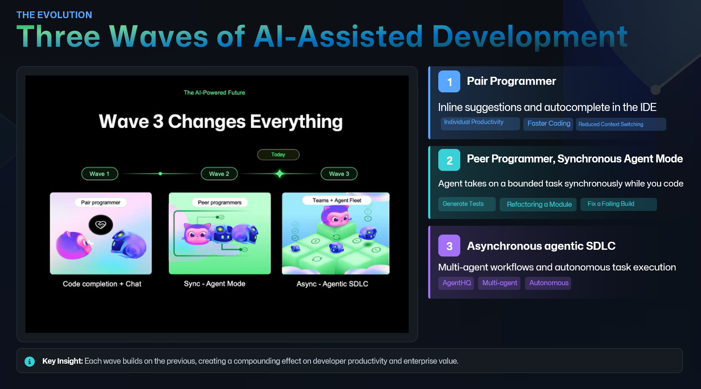

“This slide is about the evolution of AI assisted development, because the way we should use these tools depends on which wave we are in.

Wave 1 is the pair programmer.  
This is what most people think of first: inline suggestions, autocomplete, and chat in your IDE. The benefit is individual productivity, faster coding, and reduced context switching. It is great for keeping flow, but it is still mostly you doing the driving, one file at a time.

Wave 2 is the peer programmer, or synchronous agent mode.  
Now the tool can take on a bounded task while you stay present. You can say ‘generate tests for this module,’ ‘refactor this component,’ or ‘fix this failing build,’ and it will work through the steps with you watching and steering. The big shift is that the work becomes multi step and multi file, but still interactive. You and the agent are collaborators, not just prompt and response.

Wave 3 is where things get really interesting: asynchronous, agentic SDLC.  
This is multi agent workflows and more autonomous task execution. Work can happen in parallel: one agent investigates, another writes tests, another updates docs, another proposes a PR. You stop thinking in terms of ‘help me write code’ and start thinking in terms of ‘help me run a software delivery system.’

The key insight at the bottom is the important part. Each wave builds on the previous one. The impact compounds. Better suggestions lead to better refactors, which lead to better tests, which lead to fewer incidents, which leads to less firefighting, which is a direct reduction in burnout.

But rule zero still holds in every wave. You own the code. The higher the autonomy, the more you need clear constraints, good review habits, and strong feedback loops.

Next, we will talk about what guardrails make wave 2 and wave 3 safe and boring, in the best possible way.”