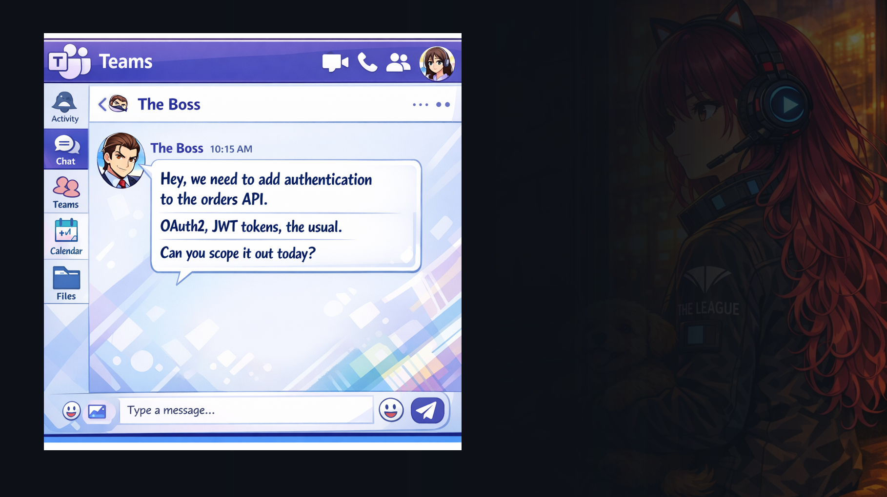

Alright, let’s make this real with a quick demo.

Here’s the scenario. You are mid flow, and you get a message like this from ‘The Boss’: ‘We need to add authentication to the orders API. OAuth2, JWT tokens, the usual. Can you scope it out today?’

That sounds straightforward, but it is actually a perfect example of why decision fatigue happens. ‘The usual’ hides a lot of decisions: which OAuth flow, who is the identity provider, what claims do we need, what is the threat model, what endpoints are public, what is the rollout plan, what breaks if we get it wrong.

This is the blank page moment. Not because you do not know how auth works, but because you are staring at a cloudy request with too many implied requirements.

So in Demo 1, I’m going to use Plan Mode in action to reduce scope ambiguity.

I will start with that vague feature request: ‘Add OAuth2 authentication with JWT support.’
Then I’ll show Copilot doing what a good senior engineer does: asking clarifying questions before writing code.
And once we have answers, I’ll have it produce a structured implementation plan with a TODO list that I can hand to myself, or hand to the team.

And finally I’ll point out where Spec Kit fits, because the fastest way to keep plans consistent is to encode the rules once, like security requirements, logging standards, and how we do configuration.

Alright, let’s switch over to VS Code and walk through it.

Alright, before we write a single line of auth code, I want to show Plan Mode doing its best work, reducing decision fatigue.

## Demo

<video controls autoplay loop muted playsinline style="width: 100%; border-radius: 8px;">
  <source src="../videos/Demo%201%20-%20Plan%20v2.mp4" type="video/mp4">
  Your browser does not support the video tag.
</video>

I start with a simple prompt: “Add OAuth2 authentication with JWT support.” That sounds clear, but in practice it hides a dozen branching decisions. If I guess wrong, I do a bunch of work, and then I redo it. Plan Mode’s job is to surface the decisions early, while changes are still cheap.

You can see Copilot first does a quick scan of the codebase and existing conventions. It notices we are already using RFC 7807 problem details for errors, and that the security requirements mention short lived tokens with refresh, bcrypt for passwords, and environment variables for secrets. That is important context because the plan should match the house style, not invent a new one.

Then it asks three clarifying questions, and these questions are the feature.

First: OAuth2 grant type. Do we need external login like Google or Entra, or are we just doing internal username and password. In this demo we choose ROPC only, internal email and password login with JWT access and refresh tokens. That single choice massively narrows the scope and makes the plan concrete.

Second: do we include RBAC now. Roles sound small, but they ripple through the entire codebase: token claims, middleware, endpoint policy decisions, tests, and docs. For the demo we choose “no RBAC”, just authenticate. Again, this is not cutting corners, it is controlling scope.

Third: where do user accounts live. The codebase currently uses an in memory store for orders, with a note about moving to Postgres later. Copilot asks if users should follow that same pattern for consistency. We pick in memory user storage for dev parity, which keeps the initial implementation aligned with existing infrastructure.

Now that those three decisions are explicit, the plan that comes next is not a vague checklist. It will be a build order: data model, auth endpoints, password hashing, token issuance and refresh, middleware for protected routes, consistent RFC 7807 errors, and tests.

This is the point of Plan Mode. It is not “make a plan”. It is “remove ambiguity”, so we reduce rework, and that reduces burnout.