---
hide:
  - navigation
  - toc
---

  

    <h1 class="home-title">Ask More. Build Better. Burn Out Less.</h1>
    
NDC Sydney · Talk by <a href="https://www.scaling-guacamole.com/" target="_blank">@Codess-Aus</a>

    <a href="#about" class="home-btn">About Michelle</a>
  

<a class="chapter-card" href="1-AskBuildBurn/">
  
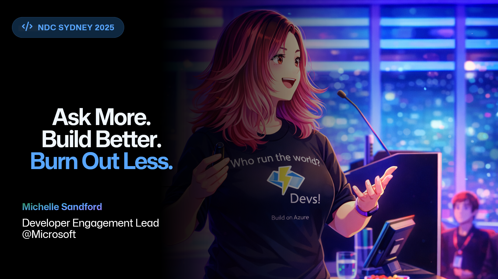

  

    Opening
    <h3>Ask More. Build Better. Burn Out Less.</h3>
    
The fastest teams are not the ones that type the most — they're the ones that reduce uncertainty early.

    Read more →
  

</a>

<a class="chapter-card" href="2-BurnoutEpidemic/">
  
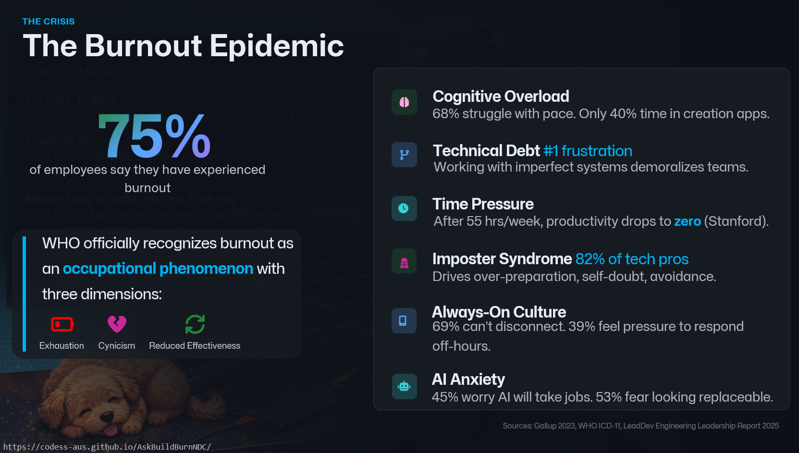

  

    The Problem
    <h3>The Burnout Epidemic</h3>
    
76% of employees experience burnout. This is the crisis we need to name before we can fix it.

    Read more →
  

</a>

<a class="chapter-card" href="3-TwoPressures/">
  
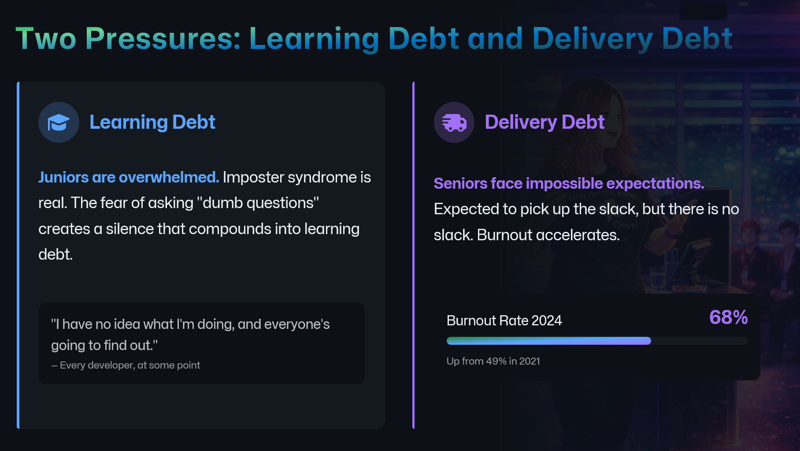

  

    The Problem
    <h3>Two Pressures: Learning Debt &amp; Delivery Debt</h3>
    
Two forces that look different but reinforce each other — and together they crush teams.

    Read more →
  

</a>

<a class="chapter-card" href="4-empowerment/">
  
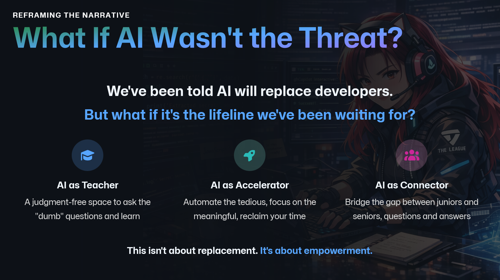

  

    Mindset
    <h3>AI: Friend, Not Foe</h3>
    
Reframing the narrative — AI does not replace developers, it removes the work that was burning them out.

    Read more →
  

</a>

<a class="chapter-card" href="5-rulezero/">
  
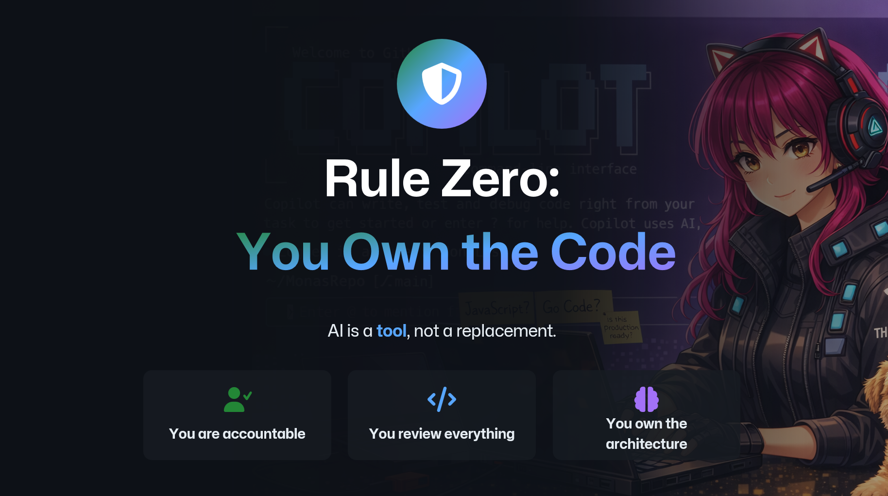

  

    Foundation
    <h3>Rule Zero: You Own the Code</h3>
    
Before any AI workflow, one grounding principle: responsibility never moves. You own what ships.

    Read more →
  

</a>

<a class="chapter-card" href="6-4Modes/">
  
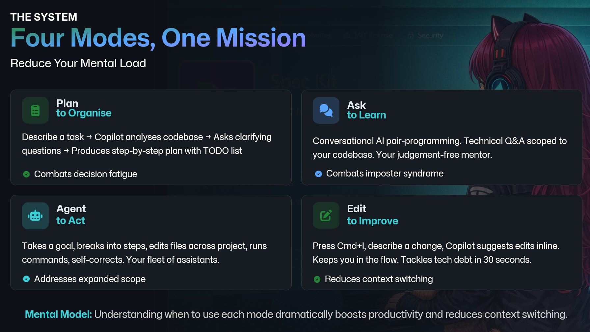

  

    Framework
    <h3>Four Modes, One Mission</h3>
    
The system: Plan, Ask, Edit, and Agent mode — each one designed to reduce a specific kind of mental load.

    Read more →
  

</a>

<a class="chapter-card" href="7-plan/">
  
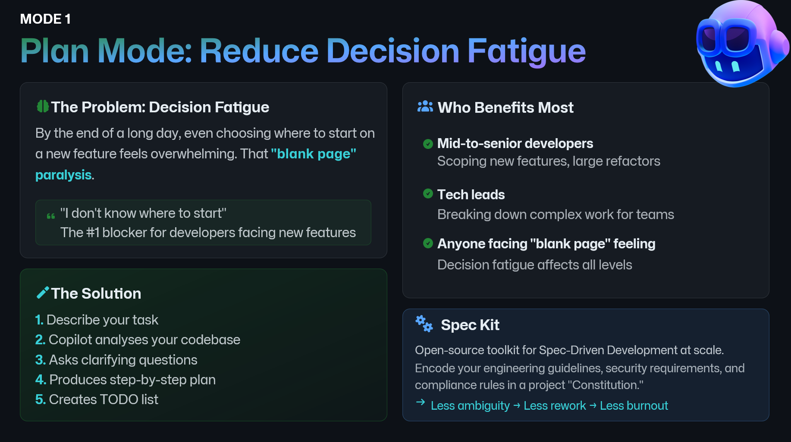

  

    Mode 1
    <h3>Plan Mode: Reduce Decision Fatigue</h3>
    
Turn "I don't know where to start" into a concrete, executable TODO list — with a Spec Kit for consistency.

    Read more →
  

</a>

<a class="chapter-card" href="8-plandemo/">
  
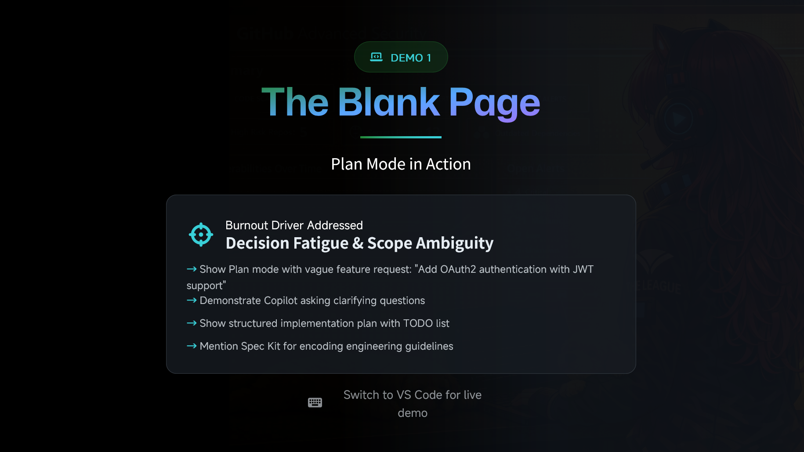

  

    Demo
    <h3>Demo: Plan Mode in Action</h3>
    
A vague auth request from The Boss becomes a structured, reviewable plan in minutes. Watch it happen.

    Watch demo →
  

</a>

<a class="chapter-card" href="9-ask/">
  
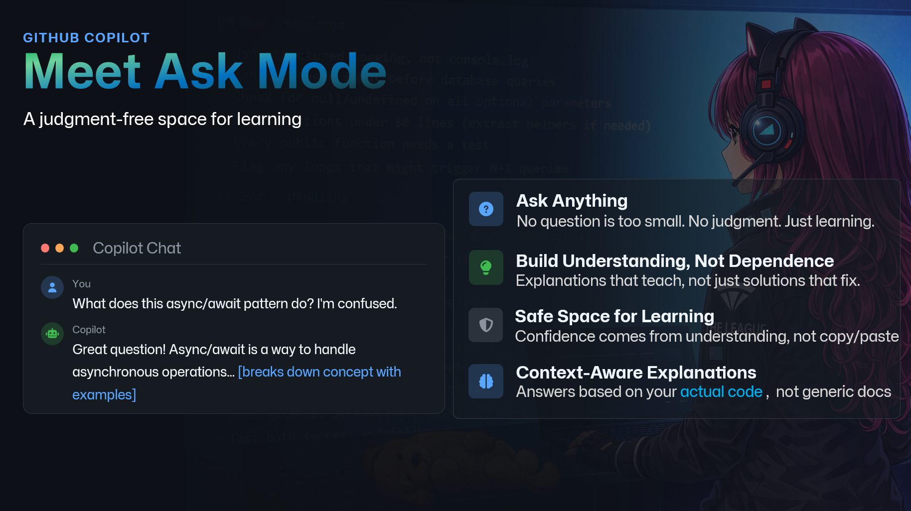

  

    Mode 2
    <h3>Ask Mode: Judgment-Free Learning</h3>
    
A safe space to ask anything. The goal is understanding, not dependence — confidence built one question at a time.

    Read more →
  

</a>

<a class="chapter-card" href="10-askdemo/">
  
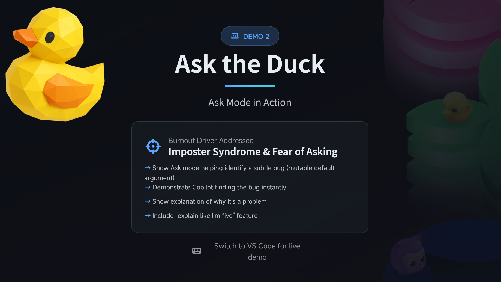

  

    Demo
    <h3>Demo: Ask the Duck</h3>
    
Spot a subtle mutable-default-argument bug, get it explained at three levels of depth, and actually understand the fix.

    Watch demo →
  

</a>

<a class="chapter-card" href="11.Mentoring/">
  
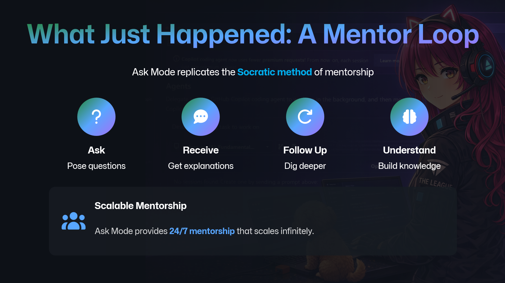

  

    Pattern
    <h3>The Mentor Loop</h3>
    
What just happened in that demo? Not just asking for answers — running a structured loop that builds capability.

    Read more →
  

</a>

<a class="chapter-card" href="12-agent/">
  
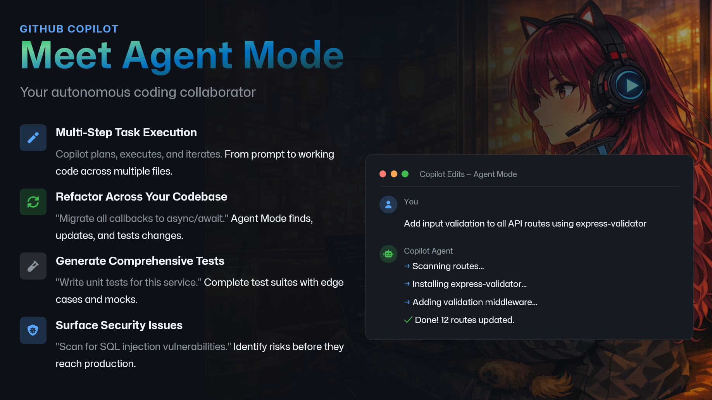

  

    Mode 3
    <h3>Agent Mode: Multi-Step Work</h3>
    
When the task spans files, requires iteration, and includes verification — this is where Agent Mode shines.

    Read more →
  

</a>

<a class="chapter-card" href="13-agentexamples/">
  
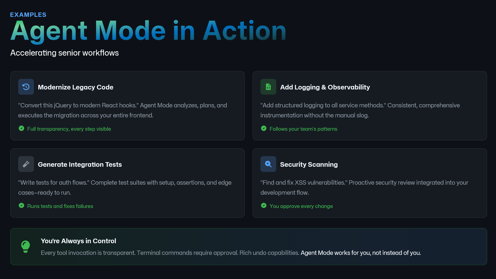

  

    Mode 3
    <h3>Agent Mode in Practice</h3>
    
Concrete real-world scenarios: refactoring, test generation, codebase migrations, and more.

    Read more →
  

</a>

<a class="chapter-card" href="14-agentdemo/">
  
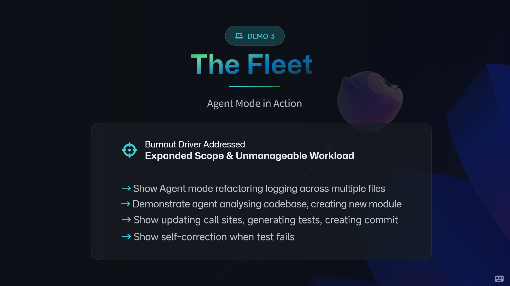

  

    Demo
    <h3>Demo: The Fleet</h3>
    
Refactor logging across a whole codebase. Watch Agent Mode scan, implement, test, self-correct, and commit.

    Watch demo →
  

</a>

<a class="chapter-card" href="15-rightway/">
  
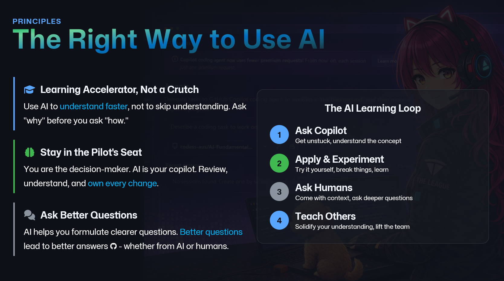

  

    Principles
    <h3>The Right Way to Use AI</h3>
    
Power is not the risk — using it poorly is. A checklist for staying in control while moving fast.

    Read more →
  

</a>

<a class="chapter-card" href="16-waves/">
  

  

    Big Picture
    <h3>The Three Waves of AI</h3>
    
From pair programmer to autonomous agent — which wave are you in, and what does it mean for how you work?

    Read more →
  

</a>

<a class="chapter-card" href="17-multiagentsdlc/">
  
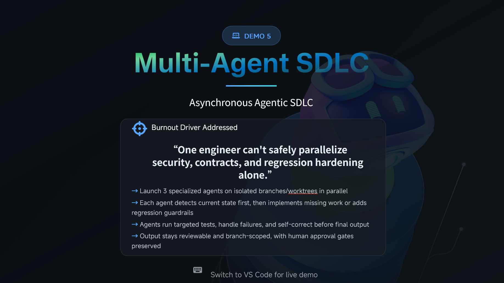

  

    Demo
    <h3>Demo: Multi-Agent SDLC</h3>
    
Three agents. Parallel branches. Security, contracts, and regression — all running simultaneously with human gates.

    Watch demo →
  

</a>

<a class="chapter-card" href="18-culture/">
  
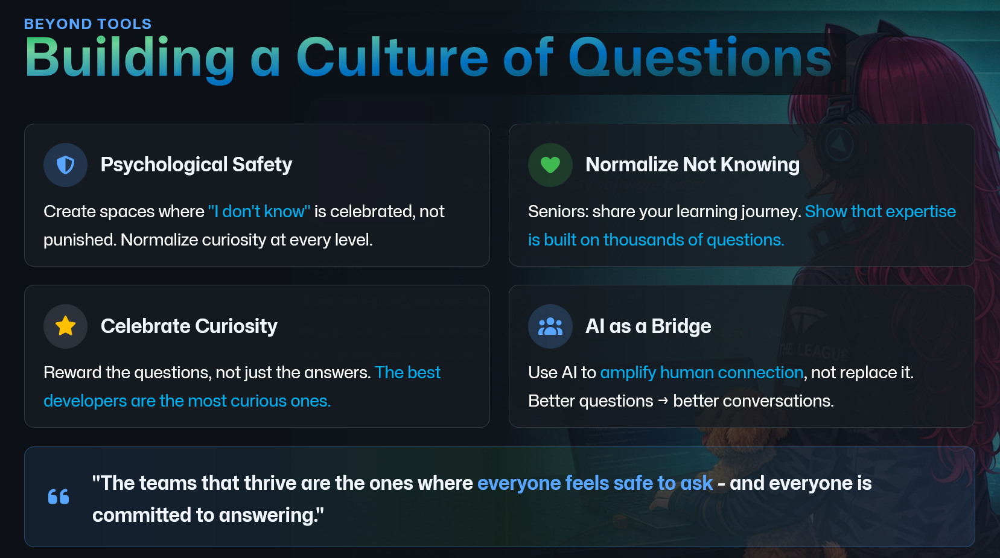

  

    Culture
    <h3>Culture is the Real Unlock</h3>
    
The best AI workflow in the world won't save a team where people are afraid to ask questions.

    Read more →
  

</a>

<a class="chapter-card" href="19-playbook/">
  
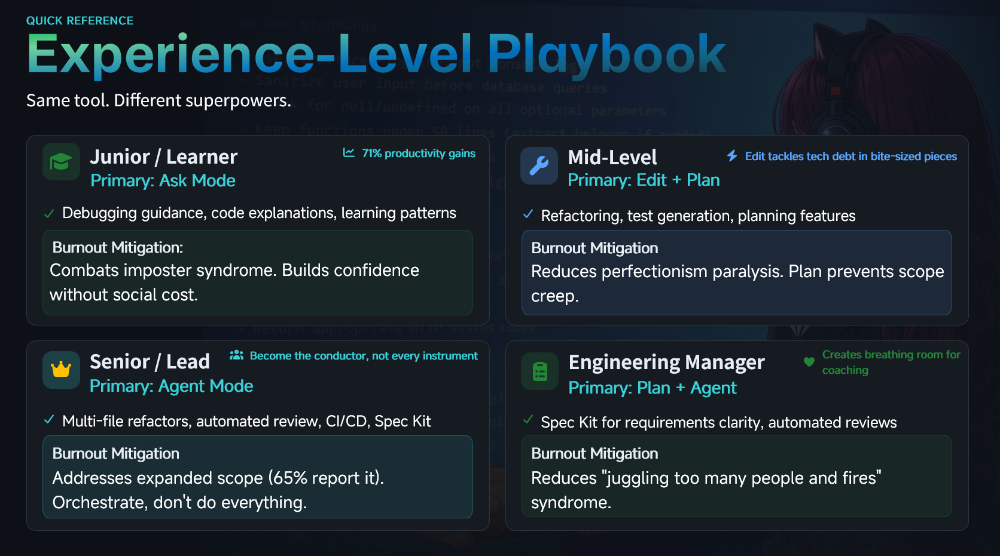

  

    Playbook
    <h3>Your Playbook by Role</h3>
    
Juniors, seniors, tech leads — the same tools give different superpowers depending on where you sit.

    Read more →
  

</a>

<a class="chapter-card" href="20-actionplan/">
  
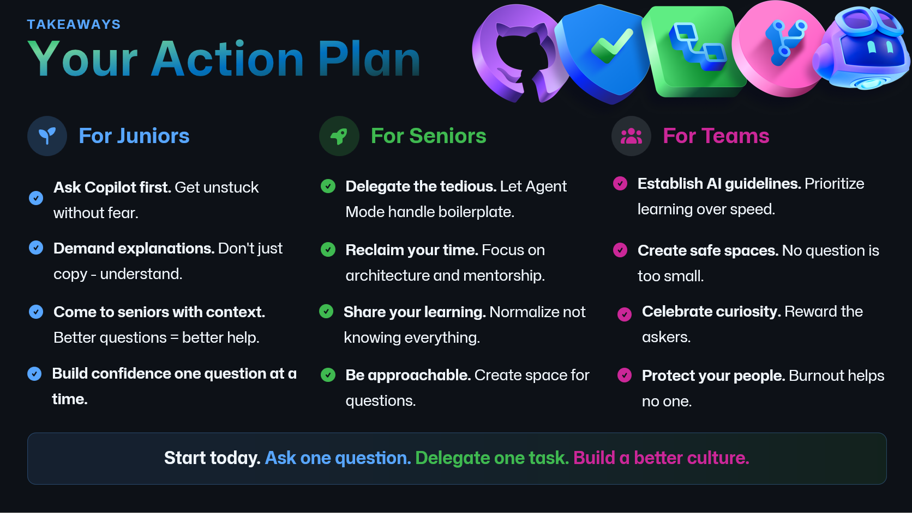

  

    Action
    <h3>Your Action Plan</h3>
    
Concrete steps to take back to work this week — for every seniority level on the team.

    Read more →
  

</a>

<a class="chapter-card" href="21-takeways/">
  
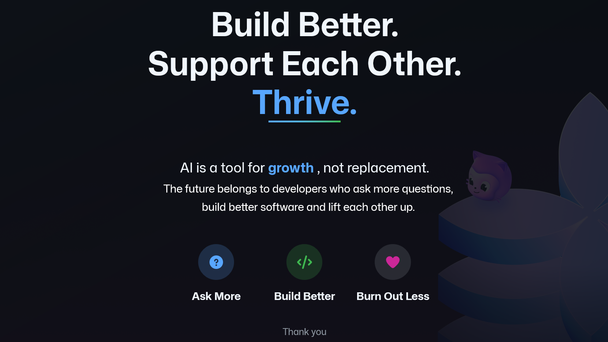

  

    Closing
    <h3>Build Better. Support Each Other. Thrive.</h3>
    
The final message: this is not just about productivity. It's about building a sustainable, human-centred craft.

    Read more →
  

</a>

  

    <h2>About Michelle Sandford</h2>
    
<strong>Developer Engagement Lead @ Microsoft</strong> · TEDx Speaker · Keynote Speaker · AI Developer

    
Michelle Sandford is a Developer Engagement Leader who writes code, builds with GitHub and Azure AI, and learns out loud. She believes shipping is better than talking about it.

    <ul>
      <li>A <strong>community builder</strong>, connecting MVPs, user groups, universities, and developer communities into thriving ecosystems.</li>
      <li>A <strong>technical storyteller</strong>, shaping how the world talks about AI-powered engineering and Azure innovation.</li>
      <li>A <strong>program strategist</strong>, designing scalable, repeatable motions that help developers grow confidence at pace with a rapidly evolving industry.</li>
      <li>A <strong>bridge between engineering and the field</strong> — making sure developers feel heard, supported, and empowered from the first line of code to final production push.</li>
    </ul>
    

      <a href="https://www.scaling-guacamole.com/" target="_blank">Blog: Scaling Guacamole</a>
      <a href="https://github.com/codess-aus" target="_blank">GitHub</a>
      <a href="https://sessionize.com/michelle-sandford/" target="_blank">Book to Speak</a>
    

  

